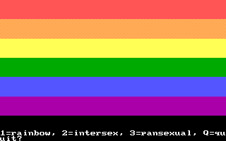

# ega-pride
A multiple-choice pride flag quiz. Requires DOS and EGA. Only 14 flags at the moment. Compiled with Microsoft QuickBasic 4.5. Runs in screen 7 (320x200x16).

The game can also be downloaded on [itch.io](https://qalle.itch.io/ega-pride).

Table of contents:
* [Technical info](#technical-info)
* [Sources of flags](#sources-of-flags)
* [To do](#to-do)

## Technical info
* Flag width: always 320 pixels.
* Flag height:
  * usually 180 pixels (divisible by 2, 3, 4, 5, 6, 9, 10 and 12, among others)
  * 182 pixels if it needs to be divisible by 7
  * 176 pixels if it needs to be divisible by 8
* The bottom two text lines are used for text, so the absolute maximum height for the flag is 200&minus;2&times;8&minus;1 = 183 pixels.

When the 320x200 mode is shown at 4:3 aspect ratio, the pixel aspect ratio is 5:6, so some details of the flags need to be stretched horizontally by 6/5 to compensate.

## Sources of flags
* [aromantic](https://commons.wikimedia.org/wiki/File:Aromantic_Pride_Flag.svg)
* [asexual](https://commons.wikimedia.org/wiki/File:Asexual_Pride_Flag.svg)
* [bisexual](https://commons.wikimedia.org/wiki/File:Bisexual_Pride_Flag.svg)
* [demisexual](https://commons.wikimedia.org/wiki/File:Demisexual_Pride_Flag.svg)
* [gay men](https://commons.wikimedia.org/wiki/File:5-striped_New_Gay_Male_Pride_Flag.svg)
* [intersex](https://commons.wikimedia.org/wiki/File:Intersex_Pride_Flag.svg)
* [lesbian](https://commons.wikimedia.org/wiki/File:Lesbian_Pride_Flag_2019.svg)
* [nonbinary](https://commons.wikimedia.org/wiki/File:Nonbinary_flag.svg)
* [omnisexual](https://commons.wikimedia.org/wiki/File:Omnisexuality_flag.svg)
* [pansexual](https://commons.wikimedia.org/wiki/File:Pansexuality_Pride_Flag.svg)
* [polyamory](https://commons.wikimedia.org/wiki/File:Tricolor_Polyamory_Pride_Flag.svg)
* [polysexual](https://commons.wikimedia.org/wiki/File:Polysexuality_Pride_Flag.svg)
* [rainbow](https://commons.wikimedia.org/wiki/File:Gay_Pride_Flag.svg)
* [transgender](https://commons.wikimedia.org/wiki/File:Transgender_Pride_flag.svg)

polyamory - heart circles: radius 20, Y1 45, Y2 75

## To do
* get more flags [here](https://github.com/qalle2/nes-pride) (see "sources of flags")
