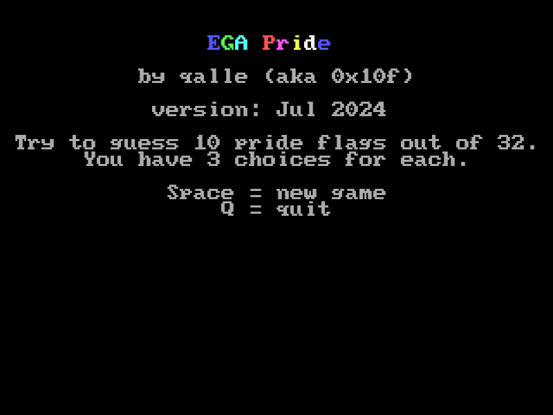
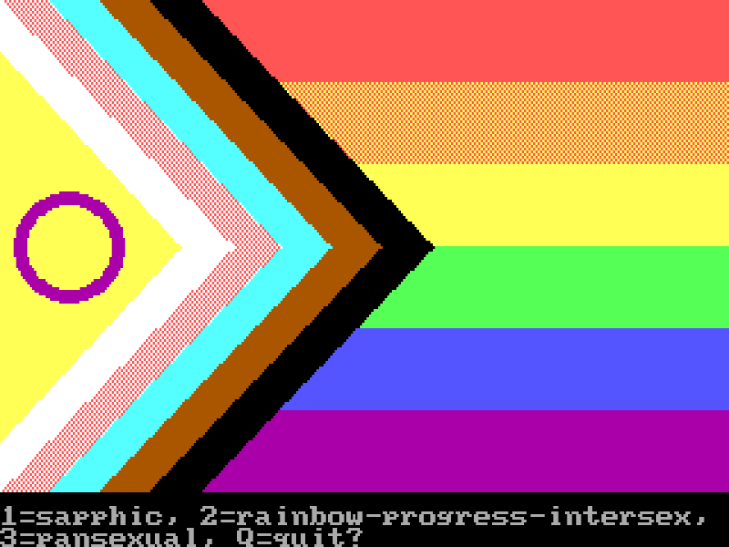

# ega-pride
A multiple-choice pride flag quiz. Requires DOS and EGA. There are 32 flags at the moment. Compiled with Microsoft QuickBasic 4.5. Runs in Screen 7 (320&times;200&times;16).

The game can also be downloaded on [itch.io](https://qalle.itch.io/ega-pride).

Table of contents:
* [Technical info](#technical-info)
* [Sources of flags](#sources-of-flags)

## Technical info
* Flag width: always 320 pixels.
* Flag height:
  * usually 180 pixels (divisible by 2, 3, 4, 5, 6, 9, 10 and 12, among others)
  * 182 pixels if it needs to be divisible by 7
  * 176 pixels if it needs to be divisible by 8
* The bottom two text lines are used for text, so the absolute maximum height for the flag is 200&minus;2&times;8&minus;1 = 183 pixels.

When the 320x200 mode is shown at 4:3 aspect ratio, the pixel aspect ratio is 5:6, so some details of the flags need to be stretched horizontally by 6/5 to compensate.

## Sources of flags
* [abrosexual](https://commons.wikimedia.org/wiki/File:Abrosexual_flag.svg)
* [aegosexual](https://lgbtqia.wiki/wiki/Aegosexual) (not yet implemented)
* [agender](https://commons.wikimedia.org/wiki/File:Agender_pride_flag.svg)
* [androgyne](https://lgbtqia.fandom.com/wiki/Androgyne) (not yet implemented)
* [androsexual](https://orientation.fandom.com/wiki/Androsexual) (not yet implemented)
* [aromantic](https://commons.wikimedia.org/wiki/File:Aromantic_Pride_Flag.svg)
* [aromantic asexual](https://commons.wikimedia.org/wiki/File:Aroace_flag.svg)
* [asexual](https://commons.wikimedia.org/wiki/File:Asexual_Pride_Flag.svg)
* [autism](https://commons.wikimedia.org/wiki/File:Autistic_Pride_Flag.png)
* [autoromantic](https://orientation.fandom.com/wiki/Autosexuality) (not yet implemented)
* [autosexual](https://orientation.fandom.com/wiki/Autosexuality) (not yet implemented)
* [bear](https://commons.wikimedia.org/wiki/File:Bear_Brotherhood_flag.svg)
* [bigender](https://commons.wikimedia.org/wiki/File:Bigender_Flag.svg)
* [bisexual](https://commons.wikimedia.org/wiki/File:Bisexual_Pride_Flag.svg)
* [butch lesbian](https://www.sexualdiversity.org/edu/flags/1097.php) (not yet implemented)
* [demiboy](https://commons.wikimedia.org/wiki/File:Demiboy_Flag.svg)
* [demigender](https://lgbtqia.fandom.com/wiki/Demigender) (not yet implemented)
* [demigirl](https://commons.wikimedia.org/wiki/File:Demigirl_Flag.svg)
* [demiromantic](https://commons.wikimedia.org/wiki/File:Demiromantic_Pride_Flag.svg)
* [demisexual](https://commons.wikimedia.org/wiki/File:Demisexual_Pride_Flag.svg)
* [disability](https://commons.wikimedia.org/wiki/File:Visually_Safe_Disability_Pride_Flag.svg)
* [fraysexual](https://orientation.fandom.com/wiki/Fraysexual) (not yet implemented)
* [gay men](https://commons.wikimedia.org/wiki/File:5-striped_New_Gay_Male_Pride_Flag.svg)
* [genderfluid](https://commons.wikimedia.org/wiki/File:Genderfluidity_Pride-Flag.svg)
* [genderqueer](https://commons.wikimedia.org/wiki/File:Genderqueer_Pride_Flag.svg)
* [greysexual](https://orientation.fandom.com/wiki/Graysexual) (not yet implemented)
* [gynesexual](https://orientation.fandom.com/wiki/Gynesexual) (not yet implemented)
* [intersex](https://commons.wikimedia.org/wiki/File:Intersex_Pride_Flag.svg)
* [leather](https://commons.wikimedia.org/wiki/File:Leather,_Latex,_and_BDSM_pride_-_Light.svg)
* [lesbian](https://commons.wikimedia.org/wiki/File:Lesbian_Pride_Flag_2019.svg)
* [neptunic](https://lgbtqia.wiki/wiki/Neptunic) (not yet implemented)
* [non-binary](https://commons.wikimedia.org/wiki/File:Nonbinary_flag.svg)
* [non-human unity](https://therian.fandom.com/wiki/Non-human_Unity_Flag)
* [omnisexual](https://commons.wikimedia.org/wiki/File:Omnisexuality_flag.svg)
* [pangender](https://gender.fandom.com/wiki/Pangender) (2nd flag, by Cats670) (not yet implemented)
* [pansexual](https://commons.wikimedia.org/wiki/File:Pansexuality_Pride_Flag.svg)
* [polyamory](https://commons.wikimedia.org/wiki/File:Tricolor_Polyamory_Pride_Flag.svg)
* [polysexual](https://commons.wikimedia.org/wiki/File:Polysexuality_Pride_Flag.svg)
* [queer](https://commons.wikimedia.org/wiki/File:Queer_Flag.svg)
* [rainbow](https://commons.wikimedia.org/wiki/File:Gay_Pride_Flag.svg)
* [rainbow-furry](https://www.inanimorphs.com/furryflags) (not yet implemented)
* [rainbow-progress](https://commons.wikimedia.org/wiki/File:LGBTQ%2B_rainbow_flag_Quasar_%22Progress%22_variant.svg)
* [rainbow-progress-intersex](https://commons.wikimedia.org/wiki/File:Intersex-inclusive_pride_flag.svg)
* [sapphic](https://lgbtqia.fandom.com/wiki/Sapphic)
* [thin rainbow-furry](https://commons.wikimedia.org/wiki/File:Furry_Pride_Flag.png) (not yet implemented)
* [transgender](https://commons.wikimedia.org/wiki/File:Transgender_Pride_flag.svg)
* [trigender](https://www.sexualdiversity.org/edu/flags/1120.php) (not yet implemented)
* [uranic](https://lgbtqia.wiki/wiki/Uranic) (by strwbryfemme) (not yet implemented)
